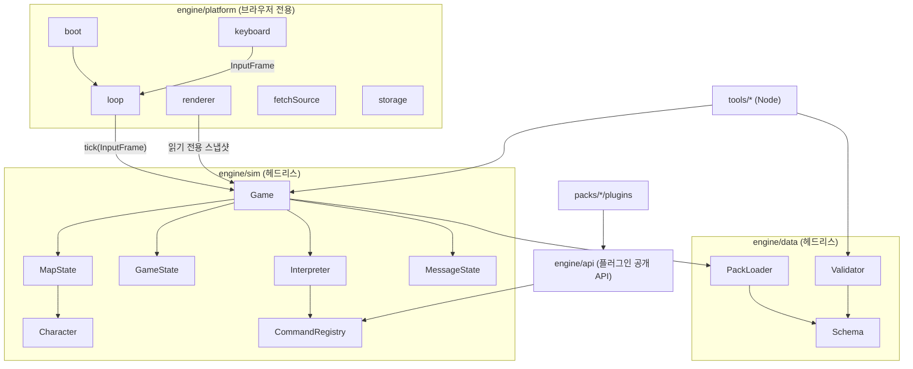

# 데이터 구동형 2D RPG 엔진 명세 (v2)

- 작성일: 2026-10-02
- 상태: **구현 명세**. Codex는 이 문서를 기준으로 구현한다
- 이전 판: [archive/02-architecture.v1.md](archive/02-architecture.v1.md) / 검토: [03-review-fable.md](03-review-fable.md) (검토 문서의 § 번호는 v1 기준)
- 표기: **반드시**는 위반하면 버그, **권장**은 판단 여지 있음, "MVP 밖"은 구현하지 않음

---

## 1. 목표와 원칙

엔진 하나로 여러 게임을 만들고, 출시 후에도 수년간 함께 유지보수한다. 게임 하나는 **팩(pack)** 이라는 데이터 폴더 하나다.

| # | 원칙 | 구체 규칙 |
|---|---|---|
| P1 | 엔진 코어는 팩을 모른다 | `engine/` 아래에 특정 게임의 ID·문자열·경로가 없어야 함. 게임 고유 기능은 팩 플러그인으로(§9) |
| P2 | 로직도 데이터다 | 대화·분기·플래그·이동은 JSON 이벤트 커맨드로 표현(§6) |
| P3 | 시뮬레이션은 화면 없이 돈다 | `engine/sim`, `engine/data`, `engine/api`는 DOM·Canvas에 접근하지 않음. Node에서 게임을 끝까지 돌려 테스트할 수 있어야 함(§4.2, §12) |
| P4 | 결정론적이다 | 같은 팩, 같은 초기 상태, 같은 입력 시퀀스면 항상 같은 결과. 시뮬레이션은 고정 60Hz 틱으로만 진행하고, 벽시계 시간과 `Math.random`을 직접 쓰지 않음 |
| P5 | 잘못된 팩은 실행 전에 거부 | 검증기(§10)가 빌드와 개발 서버 로딩에서 오류를 파일 경로 + JSON 포인터로 보고 |
| P6 | main은 항상 모든 팩이 통과 | 엔진 변경은 모든 팩의 검증과 시나리오 테스트가 통과해야 머지(§13) |

**MVP 밖**: 전투, 인벤토리, 메뉴 화면, 사운드, 다국어, 터치 입력, 멀티플레이, 애니메이션 타일, 타일 뒤집기, 텍스트 제어문자·변수 치환, 플러그인 씬(미니게임 화면), 팩 간 공유 라이브러리(§14).

---

## 2. 기술 스택

| 항목 | 선택 |
|---|---|
| 언어 | TypeScript (strict) |
| 개발 서버·번들 | Vite |
| 단위 테스트 | Vitest |
| 스키마·런타임 검증 | `@sinclair/typebox` (스키마 정의 → TS 타입 + JSON Schema + `Value.Errors` 검증을 한 소스에서) |
| Node 도구 실행 | `tsx` |
| 린트 | ESLint + typescript-eslint (import 경계 강제, §4.2) |
| 런타임 의존성 | TypeBox만. 그 외 렌더링·게임 라이브러리 사용 금지 |
| 맵 에디터 | Tiled 1.10 이상, JSON 내보내기(`.tmj`, `.tsj`) |
| 기본 해상도 | 16px 타일, 320×240 논리 해상도 (팩마다 변경 가능) |

---

## 3. 레포 구조

레포 하나에 엔진과 모든 게임 팩을 둔다(모노레포). npm 패키지는 하나다.

```
game-maker/
├── AGENTS.md                    # Codex 작업 규칙
├── package.json                 # version = 엔진 semver
├── tsconfig.json                # 공통
├── tsconfig.sim.json            # engine/sim, data, api 전용. lib에 DOM 없음
├── vite.config.ts               # vite-plugin-packs 포함 (§11.1)
├── index.html
├── engine/
│   ├── api/                     # 플러그인 공개 API. 유일한 공개 진입점 (§9)
│   ├── sim/                     # 헤드리스 게임 로직
│   │   ├── state/               # GameState, SaveData, save 마이그레이션
│   │   ├── world/               # MapState, TileMapData, Collision, Camera(좌표 계산만)
│   │   ├── entity/              # Character, Player, EventObject
│   │   ├── event/               # Interpreter, CommandRegistry, conditions, triggers
│   │   ├── commands/            # 내장 커맨드 1파일 1커맨드
│   │   ├── ui/                  # MessageState, ChoiceState (표시 상태만, 그리기 없음)
│   │   ├── Game.ts              # 틱 순서(§7.1)를 소유
│   │   └── ports.ts             # InputFrame, TextMeasurer, PackSource 인터페이스
│   ├── data/
│   │   ├── schema/              # TypeBox 스키마 (팩 파일별)
│   │   ├── validator/           # 검증 규칙 V1~V12 (§10)
│   │   ├── loader/              # PackLoader (PackSource 사용)
│   │   └── migrations/          # 팩 포맷 마이그레이션 (§13.3)
│   └── platform/                # 브라우저 전용
│       ├── boot.ts              # 진입점
│       ├── loop.ts              # rAF + 고정 틱 누산기
│       ├── keyboard.ts          # 키 → 액션
│       ├── renderer/            # Canvas 2D 그리기
│       ├── fetchSource.ts       # PackSource 브라우저 구현
│       ├── storage.ts           # localStorage
│       └── errorScreen.ts
├── tools/                       # Node CLI (tsx)
│   ├── validate.ts
│   ├── scenarios.ts
│   ├── migrate-pack.ts
│   ├── build.ts
│   ├── schemas.ts               # schemas/*.json 생성
│   └── fsSource.ts              # PackSource Node 구현
├── tests/                       # 엔진 단위 테스트 (Vitest)
├── schemas/                     # 생성물(커밋). 에디터 자동완성용
├── packs/
│   └── demo/
│       ├── game.json
│       ├── characters.json
│       ├── skin.json
│       ├── common-events.json
│       ├── maps/
│       │   ├── village.tmj
│       │   ├── village.events.json
│       │   ├── house.tmj
│       │   └── house.events.json
│       ├── plugins/             # 선택. 팩 전용 TS 플러그인
│       ├── tests/               # 시나리오 테스트 *.scenario.json
│       ├── assets/{tilesets,characters,ui,fonts}/
│       └── CREDITS.md           # 에셋 출처·라이선스. 필수
└── dist/<packId>/               # 빌드 산출물. gitignore
```

---

## 4. 런타임 구조

### 4.1 계층



### 4.2 import 경계 (반드시)

| 위치 | import 허용 대상 |
|---|---|
| `engine/sim/**` | `engine/sim`, `engine/data`, `engine/api`의 **타입만**(`import type`), typebox |
| `engine/data/**` | `engine/data`, `engine/api`의 타입, typebox |
| `engine/api/**` | `engine/sim`, `engine/data` (내부를 감싸 공개) |
| `engine/platform/**` | 전부 |
| `packs/*/plugins/**` | **`@engine/api`와 typebox만** |
| `tools/**` | 전부 (`platform` 제외) |

- ESLint `no-restricted-imports`로 강제하고, `tsconfig.sim.json`은 `"lib": ["ES2022"]`(DOM 없음)로 `sim/data/api/plugins`를 타입체크한다. `window`나 `document`를 쓰면 컴파일 오류가 나야 한다.
- 경로 별칭: `@engine/api` → `engine/api/index.ts`.

### 4.3 포트 (sim과 바깥의 접점)

```ts
type Action = 'up' | 'down' | 'left' | 'right' | 'ok' | 'cancel';

interface InputFrame {
  held: ReadonlySet<Action>;     // 이번 틱에 눌려 있는 키
  pressed: ReadonlySet<Action>;  // 이번 틱에 새로 눌린 키 (직전 틱 이후 keydown)
}

interface TextMeasurer {
  width(text: string): number;   // 논리 픽셀
}

interface PackSource {
  readJson(path: string): Promise<unknown>;  // 팩 루트 기준 상대경로
  exists(path: string): Promise<boolean>;
}
```

- 브라우저 `TextMeasurer`는 Canvas `measureText`를 쓴다. 헤드리스 구현은 근사값을 쓴다. 코드포인트 U+1100 이상은 `fontSize`, 그 외는 `fontSize / 2`. 그래서 줄바꿈 위치가 브라우저와 다를 수 있다. 시나리오 테스트는 페이지 수에 의존하면 안 된다(§12).
- 키 매핑(platform): 화살표/WASD → 방향, Z/Enter/Space → `ok`, X/Escape → `cancel`. 한 틱 사이에 눌렀다 뗀 키도 `pressed`에 반영한다(keydown 버퍼링).

### 4.4 게임 루프 (platform/loop)

- 고정 틱 `1/60`초. 누산기 방식으로, rAF 프레임마다 쌓인 시간만큼 `game.tick()`을 호출한다.
- 프레임 사이 경과 시간은 **최대 0.25초로 자른다**. 탭 복귀 시 수백 틱이 몰려 실행되는 것을 막는다.
- 렌더링은 rAF마다 1회. 틱 사이 보간은 하지 않는다(픽셀 게임이라 필요 없음).
- `pressed`는 소비된 틱에서만 참이다. 한 rAF에 틱이 여러 번 돌면 첫 틱에만 전달한다.

### 4.5 화면

- Canvas 논리 해상도 = `game.json.screen`. CSS로 **창에 들어가는 최대 정수배**로 확대하고(최소 1), `image-rendering: pixelated`, `imageSmoothingEnabled = false`를 적용한다. 창 크기가 바뀌면 다시 계산한다.

---

## 5. 팩 데이터 명세

공통 규칙
- 모든 경로는 팩 루트 기준 상대경로. `..`으로 팩 밖을 가리키면 검증 오류.
- ID 형식: `^[a-z][a-z0-9_]*$`. 플러그인 커맨드·조건 이름만 `^x_[a-z0-9_]+$`.
- 맵 ID = `maps/` 아래 파일명에서 확장자를 뺀 것.
- 좌표는 타일 단위 정수, 원점은 좌상단. 방향 `Dir = "up" | "down" | "left" | "right"`.
- 플래그는 boolean, 변수는 정수(`Number.isSafeInteger`).

### 5.1 `game.json`

```json
{
  "$schema": "../../schemas/game.schema.json",
  "id": "demo",
  "title": "작은 마을의 비밀",
  "version": "0.1.0",
  "formatVersion": 1,
  "screen": { "width": 320, "height": 240 },
  "tileSize": 16,
  "maps": ["village", "house"],
  "start": { "map": "village", "x": 10, "y": 8, "dir": "down" },
  "player": "hero",
  "plugins": [],
  "labels": { "continue": "이어하기", "newGame": "처음부터" },
  "state": {
    "flags": { "met_elder": false },
    "vars": { "gold": 0 }
  }
}
```

| 필드 | 규칙 |
|---|---|
| `id` | 팩 폴더 이름과 같아야 함. 세이브 키에 쓰임 |
| `version` | 게임 버전, semver. 릴리스 태그와 세이브에 기록 |
| `formatVersion` | 팩 데이터 포맷 버전. 엔진의 `CURRENT_FORMAT_VERSION`과 **정확히 같아야** 로드됨(§13) |
| `maps` | 이 팩의 맵 ID 전체 목록. 브라우저는 디렉터리를 나열할 수 없어서 명시함. 목록에 없는 `maps/*.tmj`는 경고 |
| `plugins` | 플러그인 이름 목록. `plugins/<이름>.ts`를 로드(§9) |
| `labels` | 엔진이 표시하는 시스템 문구. 엔진 코드에 문자열을 넣지 않기 위함(P1) |
| `state` | 사용할 플래그·변수의 **선언과 초기값**. 선언하지 않은 것을 참조하면 검증 오류 |

### 5.2 `characters.json`

```json
{
  "hero": {
    "sheet": "assets/characters/hero.png",
    "frameWidth": 16, "frameHeight": 24,
    "rows": { "down": 0, "left": 1, "right": 2, "up": 3 },
    "walkFrames": [0, 1, 0, 2],
    "frameTicks": 8,
    "moveTicks": 16
  },
  "elder": {
    "placeholder": "#c08040",
    "moveTicks": 20
  }
}
```

- `sheet` 또는 `placeholder` 중 **정확히 하나**가 있어야 한다. `placeholder`는 에셋이 없을 때 타일 크기의 단색 사각형과 방향 표시 삼각형으로 그린다. 데모와 초기 개발용이다.
- `rows` 기본값은 `{down:0,left:1,right:2,up:3}`, `walkFrames` 기본값은 `[0,1,0,2]`, `frameTicks` 기본값은 8. 정지 상태에서는 `walkFrames[0]`을 그린다.
- `moveTicks`: 한 칸 이동에 걸리는 틱 수, 기본값 16.
- 그리기 기준점: 프레임의 하단 중앙을 타일의 하단 중앙에 맞춘다.

### 5.3 `skin.json`

```json
{
  "font": { "family": "Galmuri11", "src": "assets/fonts/Galmuri11.woff2", "size": 12, "lineHeight": 16 },
  "window": { "image": "assets/ui/window.png", "slice": 8, "padding": 8 },
  "colors": { "text": "#ffffff", "speaker": "#ffd866", "cursor": "#ffffff", "fade": "#000000" },
  "message": { "rows": 3, "charsPerTick": 1 }
}
```

- `window.image`는 9-slice로 그린다(모서리 `slice`px 고정, 변과 중앙은 늘림). 생략하면 반투명 검정 사각형과 흰 1px 테두리로 그린다.
- 메시지 창은 화면 하단 전체 폭이고, 높이 = `rows × lineHeight + padding × 2`. 화자 이름은 본문 첫 줄 위에 별도 줄로 표시한다(`rows`에 포함되지 않음).
- 폰트는 `FontFace`로 로드하며, 로드가 끝나기 전에는 게임을 시작하지 않는다.

### 5.4 맵: Tiled `.tmj`

| 요소 | 규칙 |
|---|---|
| 맵 | `orientation: "orthogonal"`, `infinite: false`, `tilewidth = tileheight = game.tileSize`. 위반하면 검증 오류 |
| 타일셋 | 임베드 또는 외부 `.tsj`. 여러 개 허용(`firstgid`). 이미지 경로는 `.tmj`/`.tsj` 파일 위치 기준 |
| 타일 GID | 상위 4비트(뒤집기 플래그)는 마스킹해서 무시. MVP 밖 |
| 레이어 `collision` | tilelayer. GID가 0이 아니면 통행 불가. 그리지 않음. 없으면 전부 통행 가능 |
| 레이어 이름이 `over_`로 시작 | 캐릭터 위에 그림 |
| 그 외 tilelayer | 캐릭터 아래에 Tiled 순서대로 그림. `visible: false`는 그리지 않음 |
| 레이어 `markers` | objectgroup. **point 객체만**. `name`이 마커 ID(맵 안에서 유일). 타일 좌표 = `floor(x / tileSize)`, `floor(y / tileSize)` |
| 그룹 레이어 | 지원하지 않음(검증 오류) |

### 5.5 맵 이벤트: `maps/<맵ID>.events.json`

```json
{
  "events": [
    {
      "id": "elder",
      "x": 12, "y": 6,
      "pages": [
        {
          "when": { "flag": "met_elder", "is": false },
          "character": "elder", "dir": "down",
          "trigger": "action",
          "commands": [
            { "cmd": "face", "target": "this", "dir": "player" },
            { "cmd": "text", "speaker": "촌장", "text": "처음 보는 얼굴이군." },
            { "cmd": "choice", "prompt": "뭐라고 답할까?", "options": [
              { "label": "여행자입니다", "commands": [
                { "cmd": "text", "speaker": "촌장", "text": "북쪽 동굴은 조심하게." }
              ]},
              { "label": "…", "commands": [] }
            ]},
            { "cmd": "set_flag", "flag": "met_elder", "value": true }
          ]
        },
        {
          "when": { "flag": "met_elder", "is": true },
          "character": "elder", "dir": "down",
          "trigger": "action",
          "commands": [ { "cmd": "text", "speaker": "촌장", "text": "또 왔나." } ]
        }
      ]
    },
    {
      "id": "chest",
      "x": 3, "y": 4,
      "pages": [
        { "when": { "self": "opened", "is": false }, "character": "chest_closed", "trigger": "action",
          "commands": [
            { "cmd": "text", "text": "금화 10개를 얻었다." },
            { "cmd": "set_var", "var": "gold", "op": "add", "value": 10 },
            { "cmd": "set_self_flag", "name": "opened", "value": true }
          ] },
        { "when": { "self": "opened", "is": true }, "character": "chest_open", "trigger": "none" }
      ]
    },
    {
      "id": "to_house",
      "x": 5, "y": 3,
      "pages": [{
        "trigger": "touch", "through": true,
        "commands": [ { "cmd": "transfer", "map": "house", "marker": "door_in", "dir": "up" } ]
      }]
    }
  ]
}
```

이벤트 필드
| 필드 | 필수 | 규칙 |
|---|---|---|
| `id` | O | 맵 안에서 유일 |
| `x`, `y` | O | 맵 범위 안 |
| `pages` | O | 1개 이상 |

페이지 필드
| 필드 | 기본값 | 규칙 |
|---|---|---|
| `when` | 없음(항상 참) | 조건식(§5.7) |
| `character` | 없음 | 생략하면 그래픽 없음 |
| `dir` | `"down"` | 페이지가 활성화될 때의 방향 |
| `trigger` | 필수 | `action` / `touch` / `auto` / `parallel` / `none` (§7.3) |
| `through` | `false` | true면 통행을 막지 않음 |
| `commands` | `[]` | 커맨드 목록 |

### 5.6 `common-events.json`

```json
{ "inn_rest": { "commands": [ { "cmd": "fade", "to": "black" }, { "cmd": "wait", "frames": 30 }, { "cmd": "fade", "to": "clear" } ] } }
```

`call` 커맨드로만 실행한다. 공통 이벤트 안의 `this`, 셀프 플래그, `face`의 `"player"` 등은 **호출한 이벤트**를 가리킨다.

### 5.7 조건식

```json
{ "flag": "met_elder", "is": true }
{ "var": "gold", "op": ">=", "value": 10 }
{ "self": "opened", "is": true }
{ "all": [ <조건>, ... ] }
{ "any": [ <조건>, ... ] }
{ "not": <조건> }
{ "plugin": "x_has_item", "args": { "item": "key" } }
```

- `op`: `==` `!=` `>` `>=` `<` `<=`. `value`는 정수 리터럴만 허용한다.
- `all: []`는 참, `any: []`는 거짓이다.
- `self`는 이벤트 문맥에서만 유효하다. 페이지의 `when`이나 이벤트·공통 이벤트 커맨드 안에서만 쓸 수 있다.

### 5.8 셀프 플래그

- 이벤트마다 따로 갖는 boolean 플래그다. 키는 `"<맵ID>:<이벤트ID>:<이름>"`, 이름은 ID 형식을 따른다.
- **선언하지 않는다.** 기본값은 false다.
- 세이브에 포함된다. 맵 재진입 후에도 유지된다(이벤트의 위치·방향·표시 여부는 유지되지 않음, §7.6).

---

## 6. 이벤트 커맨드

공통: 모든 커맨드는 `{ "cmd": "<이름>", ...필드 }` 형태다. 알 수 없는 필드는 검증 오류다. `target`은 `"player"`, `"this"`(현재 이벤트), 또는 같은 맵의 이벤트 ID다.

| `cmd` | 필드 (기본값) | 동작 | 대기 | parallel |
|---|---|---|---|---|
| `text` | `text`, `speaker?` | 메시지 창 표시(§8.1) | 창이 닫힐 때까지 | 금지 |
| `choice` | `prompt?`, `options[{label, when?, commands}]`(1~6개), `cancel?`(null) | 선택지 표시(§8.2), 고른 옵션의 `commands` 실행. `when`이 거짓인 옵션은 **숨김**. `cancel`은 cancel 키를 눌렀을 때 선택할 옵션 인덱스(원래 배열 기준). null이면 cancel 키 무시 | 선택 + 하위 실행 끝까지 | 금지 |
| `if` | `cond`, `then`, `else`(`[]`) | 조건에 따라 분기 | 하위 실행 끝까지 | 허용 |
| `call` | `common` | 공통 이벤트 실행 | 끝날 때까지 | 공통 이벤트 내용에 따름 |
| `wait` | `frames`(1 이상) | 틱 단위 대기 | O | 허용 |
| `stop` | – | 현재 인터프리터의 실행 전체를 끝냄(호출 중인 공통 이벤트와 바깥 이벤트 모두) | – | 허용 |
| `set_flag` | `flag`, `value` | 플래그 설정 | – | 허용 |
| `set_var` | `var`, `op`(`set`/`add`/`sub`, 기본 `set`), `value`(정수) | 변수 변경. 결과가 안전 정수 범위를 벗어나면 런타임 오류 | – | 허용 |
| `set_self_flag` | `name`, `value` | 현재 이벤트의 셀프 플래그 설정 | – | 허용 |
| `transfer` | `map`, `marker` **또는** `x`+`y`, `dir?`(현재 유지), `fade`(true) | 맵 이동(§7.5) | 완료까지 | 금지 |
| `move` | `target`, `route`(토큰 배열), `wait`(false) | 이동 경로 실행(§7.4) | `wait`가 true면 경로 완료까지 | 허용 |
| `face` | `target`, `dir`(`Dir` 또는 `"player"`) | 방향 전환. `"player"`는 플레이어를 바라봄 | – | 허용 |
| `fade` | `to`(`black`/`clear`), `frames`(30), `wait`(true) | 화면 페이드 | `wait`가 true면 완료까지 | 허용 |
| `shake` | `power`(4, px), `frames`(30), `wait`(false) | 화면 흔들기. 오프셋은 결정론적 패턴 `power × sin(t × 1.3)` | `wait`가 true면 완료까지 | 허용 |
| `show_character` | `target`(이벤트만), `visible` | 그리기 여부만 바꿈. 통행 판정에는 영향 없음 | – | 허용 |
| `save` | – | 슬롯 1에 저장(§11.3) | – | 금지 |

`move.route` 토큰
| 토큰 | 의미 |
|---|---|
| `up` `down` `left` `right` | 그 방향을 보고 한 칸 이동. 막히면 방향만 바꾸고 **다음 토큰으로 넘어감** |
| `face:<dir>` | 방향만 바꿈 |
| `wait:<n>` | n틱 대기 |

텍스트 규칙
- `\n`은 강제 줄바꿈이다. 그 외 제어문자, `\v[...]`, `{var}` 치환은 **MVP 밖이다. 구현하지 말 것.**
- `text`와 `label`은 비어 있으면 안 된다.

---

## 7. 시뮬레이션 동작 규칙

### 7.1 틱 순서 (Game.tick, 반드시 이 순서)

1. **페이지 재계산**: 직전 틱 이후 상태가 바뀌었으면(dirty) 현재 맵의 모든 이벤트의 활성 페이지를 다시 계산한다(§7.2).
2. **UI 갱신**: 메시지나 선택 창이 열려 있으면 입력을 소비해 진행한다(§8). 이 틱의 `pressed`는 이후 단계에 전달하지 않는다.
3. **메인 인터프리터**
   - 실행 중이면 `update()`.
   - 실행 중이 아니면 시작 후보를 검사한다. 순서: (a) 대기 중인 트리거 슬롯(§7.3) (b) 활성 페이지가 `auto`인 이벤트 중 이벤트 배열 순서로 첫 번째. 시작했으면 같은 틱에 `update()`를 1회 실행한다.
4. **플레이어 입력**: 메인이 실행 중이 아니고 창이 열려 있지 않을 때만 처리한다. 방향 입력 → 이동 시도, `ok` → action 트리거 검사.
5. **parallel 인터프리터**: 이벤트 배열 순서로 각각 `update()` 1회.
6. **캐릭터 이동 진행**: 모든 캐릭터의 이동 보간과 route 진행. 플레이어가 한 칸 이동을 마쳤으면 touch 검사(§7.3).
7. **화면 효과 진행**: fade, shake 진행률.
8. **plugin `tick` 훅** 호출.

상태 변경(set_flag 등)은 즉시 반영되어 같은 틱 안의 `if` 판정에 보인다. 페이지 재계산만 다음 틱 1단계로 미룬다.

### 7.2 이벤트 페이지

- 활성 페이지 = `when`이 참인 페이지 중 **배열에서 가장 뒤에 있는 것**. 없으면 이벤트가 비활성이다(그리지 않고, 막지 않고, 트리거도 없음).
- 활성 페이지가 바뀌면 그래픽과 `dir`을 새 페이지 값으로 초기화한다. 같은 페이지가 유지되면 아무것도 바꾸지 않는다.
- 맵에 들어올 때 모든 이벤트의 페이지를 계산한다.

### 7.3 트리거

| trigger | 발동 조건 | 실행 위치 |
|---|---|---|
| `action` | 플레이어가 `ok`를 눌렀을 때 ① 정면 칸의 이벤트 ② 없으면 플레이어가 서 있는 칸의 이벤트(`through: true`인 것). 같은 칸에 여럿이면 배열 순서로 첫 번째 | 메인 |
| `touch` | ① 플레이어가 한 칸 이동을 **마친 틱**에 그 칸의 이벤트(`through: true`) ② 플레이어가 `through: false`인 touch 이벤트 쪽으로 이동을 시도해 막혔을 때 | 메인 |
| `auto` | 활성인 동안, 메인이 비면 시작 | 메인 |
| `parallel` | 활성인 동안 계속. 끝나면 다음 틱에 처음부터 다시 | 이벤트별 전용 |
| `none` | 발동하지 않음 | – |

- action과 touch는 **트리거 슬롯**(1칸)에 넣고 다음 틱 3단계에서 시작한다. 슬롯이 이미 차 있으면 새 트리거는 버린다.
- `transfer`로 도착한 칸에서는 touch가 발동하지 않는다. 떠났다가 다시 들어와야 한다.
- 메인 인터프리터는 시작할 때의 commands 배열을 끝까지 실행한다. 실행 도중 그 이벤트의 페이지가 바뀌어도 중단하지 않는다.
- parallel 인터프리터는 자기 이벤트의 활성 페이지가 바뀌면 1단계에서 **중단**한다. 새 페이지가 parallel이면 새로 시작한다.

### 7.4 이동과 충돌

- 캐릭터는 타일 단위로 움직이고, `moveTicks` 동안 선형 보간한다.
- **통행 판정**(목표 칸): 맵 범위 안이고, `collision`이 0이고, 그 칸을 점유하거나 예약한 다른 캐릭터가 없어야 한다. `through: true`인 이벤트는 점유하지 않는다. 비활성 이벤트도 점유하지 않는다. `through`인 캐릭터 자신은 다른 캐릭터에 막히지 않지만 맵 경계와 `collision`에는 막힌다.
- 이동을 시작하면 목표 칸을 **예약**하고, 출발 칸은 도착할 때까지 계속 점유한다.
- 플레이어는 방향 키를 누르고 있는 동안 연속으로 이동한다. 이동 중이 아닐 때 방향 키를 누르면, 막혀 있어도 그 방향을 본다.
- 이벤트의 route가 끝나기 전에 같은 target에 새 `move`가 오면 기존 route를 버리고 새 route로 교체한다(진행 중인 한 칸 이동은 마침).

### 7.5 맵 이동 (`transfer`)

1. `fade`가 true면 15틱 동안 페이드 아웃.
2. 현재 맵의 parallel 인터프리터를 전부 중단한다. plugin `mapLeave` 훅을 호출한다.
3. 새 맵을 로드한다(필요한 `.tmj`·이미지. 이미 로드했으면 캐시를 쓴다). 로드하는 동안 메인 인터프리터는 대기한다. 로드에 실패하면 치명 오류 화면(§11.4).
4. 플레이어를 배치한다. `dir`이 있으면 바꾸고, 진행 중이던 이동과 route는 버린다. 이벤트를 정의값으로 생성하고 페이지를 계산한다. plugin `mapEnter` 훅을 호출한다.
5. `fade`가 true면 15틱 동안 페이드 인.
6. 메인 인터프리터는 `transfer` **다음 커맨드부터 새 맵에서 계속** 실행한다. 이때 `this`는 이전 맵의 이벤트 데이터를 그대로 참조한다. 셀프 플래그 키는 원래 맵 ID를 쓰고, `face`/`move`의 `"this"`는 아무것도 하지 않는다.

### 7.6 상태 수명

| 대상 | 맵 재진입 시 | 세이브 |
|---|---|---|
| 플래그, 변수, 셀프 플래그 | 유지 | 포함 |
| 플레이어 맵·좌표·방향 | – | 포함 |
| 이벤트 위치, 방향, `show_character` 표시 여부, route | **정의값으로 초기화** | 미포함 |
| 화면 효과(fade, shake) | 유지 | 미포함(로드 시 clear) |

### 7.7 카메라

- 플레이어의 보간된 픽셀 위치를 화면 중앙에 둔다. 맵 경계 밖은 보이지 않게 클램프한다. 맵이 화면보다 작은 축은 맵을 화면 중앙에 둔다.
- 흔들기 오프셋은 카메라 결과에 더한다. UI에는 적용하지 않는다.

### 7.8 렌더 순서 (platform)

below 레이어 → 캐릭터(보간된 픽셀 y 오름차순, 같으면 플레이어 먼저, 그다음 이벤트 배열 순서) → `over_*` 레이어 → fade 오버레이 → 메시지·선택 창. 렌더러는 sim의 상태를 **읽기만** 한다.

---

## 8. 인터프리터와 UI

### 8.1 인터프리터 (제너레이터 코루틴, 반드시)

```ts
type Wait =
  | { kind: 'frames'; n: number }
  | { kind: 'until'; test: () => boolean };

type CommandGen<R = void> = Generator<Wait, R, void>;
type CommandHandler<A> = (args: A, ctx: CommandContext) => CommandGen | void;
```

- `Interpreter.update()`
  1. 대기 중이면: `frames`는 1 감소시키고 0이 되면 해제한다. `until`은 `test()`가 참이면 해제한다. 해제되지 않았으면 반환한다.
  2. 제너레이터를 `next()`로 진행하고, 다음 `Wait`를 yield하거나 끝날 때까지 반복한다.
  3. 한 번의 `update()`에서 대기 없이 커맨드를 **10,000개 넘게** 실행하면 `InterpreterLoopError`를 던진다(치명 오류).
- 하위 목록 실행: `yield* ctx.runCommands(list)`. `runCommands`는 커맨드를 하나 실행할 때마다 `ctx.stopped`를 확인하고, 참이면 반환한다.
- 동기 커맨드(set_flag 등)는 `void`를 반환한다. 대기가 필요한 커맨드만 제너레이터다.
- 중단: `interpreter.abort()`는 `generator.return()`을 호출한다. 핸들러는 정리 작업만 `try/finally`에 둔다.
- `call` 깊이가 16을 넘으면 런타임 오류. 순환 호출은 검증기가 미리 막는다(V8).
- 내장 커맨드도 플러그인과 **같은** `CommandRegistry.register()`로 등록한다. 내장 커맨드에만 있는 특권 경로는 없다.

### 8.2 메시지 (`MessageState`, sim)

- 열기: `ctx.showText({ text, speaker })` → `CommandGen`. 창이 닫힐 때 끝난다.
- 줄바꿈: `TextMeasurer`로 창 내부 폭에 맞춰 단어 단위로 줄을 나눈다. 단어 하나가 폭보다 길면 글자 단위로 나눈다. `\n`은 강제 줄바꿈이다. `rows`줄씩 끊어 페이지를 만든다.
- 진행: 틱마다 `charsPerTick`글자씩 드러낸다. `ok`를 누르면, 아직 다 드러나지 않았으면 전부 드러내고, 다 드러났으면 다음 페이지로 넘어가거나 마지막 페이지면 닫는다. `cancel`은 `ok`와 같다.

### 8.3 선택지 (`ChoiceState`, sim)

- 열기: `const index = yield* ctx.showChoice({ prompt, labels, cancelIndex })`. 반환값은 **원래 options 배열 기준** 인덱스다.
- 화면 중앙 하단에 표시한다. `prompt`가 있으면 첫 줄에 표시한다. 커서는 첫 번째 보이는 옵션에서 시작하고, 위/아래로 이동하며 끝에서 반대쪽으로 순환한다. `ok`로 확정, `cancel`은 `cancelIndex`가 null이 아니면 확정한다.
- 보이는 옵션이 0개면 선택지를 열지 않고 아무것도 실행하지 않는다.

---

## 9. 플러그인 API v1

팩 전용 기능은 `packs/<id>/plugins/<이름>.ts`에 둔다. 엔진 코어를 고치지 않는다.

```ts
// packs/demo/plugins/fishing.ts
import { Type } from '@sinclair/typebox';
import type { PluginModule } from '@engine/api';

const plugin: PluginModule = {
  apiVersion: 1,
  id: 'fishing',
  register(api) {
    api.commands.register('x_fish', {
      args: Type.Object({ spot: Type.String() }),
      parallelSafe: false,
      *run(args, ctx) {
        yield* ctx.showText({ text: '찌를 던졌다…' });
        yield ctx.waitFrames(60);
        ctx.state.setVar('fish', ctx.state.getVar('fish') + 1);
      },
    });
  },
};
export default plugin;
```

### 9.1 공개 표면 (`engine/api/index.ts`가 export하는 것만)

```ts
export const API_VERSION = 1;

export interface PluginModule {
  apiVersion: 1;
  id: string;
  register(api: EngineApi): void;
}

export interface EngineApi {
  readonly engineVersion: string;
  commands: {
    register<S extends TSchema>(name: `x_${string}`, def: {
      args: S;                    // cmd 필드를 뺀 나머지 필드의 스키마
      parallelSafe?: boolean;     // 기본 false. false면 parallel에서 쓸 때 검증 오류
      run: CommandHandler<Static<S>>;
    }): void;
  };
  conditions: {
    register<S extends TSchema>(name: `x_${string}`, def: {
      args: S;
      test(args: Static<S>, state: ReadonlyGameState): boolean;
    }): void;
  };
  hooks: {
    on(event: 'mapEnter' | 'mapLeave', fn: (ctx: HookContext, mapId: string) => void): void;
    on(event: 'tick', fn: (ctx: HookContext) => void): void;
    on(event: 'loadSave', fn: (save: SaveData, fromGameVersion: string) => void): void;
  };
}

export interface CommandContext {
  state: GameStateAccess;                 // get/setFlag, get/setVar, get/setSelf (선언 안 된 키는 throw)
  thisEvent: { mapId: string; id: string } | null;
  player: { readonly mapId: string; readonly x: number; readonly y: number; readonly dir: Dir };
  waitFrames(n: number): Wait;
  waitUntil(test: () => boolean): Wait;
  runCommands(list: readonly Command[]): CommandGen;
  showText(req: { text: string; speaker?: string }): CommandGen;
  showChoice(req: { prompt?: string; labels: (string | null)[]; cancelIndex: number | null }): CommandGen<number>;
  readonly stopped: boolean;
  stop(): void;
}
```

- `labels`에서 null은 숨긴 옵션이다(인덱스를 유지하기 위함).
- `HookContext`는 `state`, `player`, `mapId`를 제공한다. 훅 안에서는 대기할 수 없다.
- 플러그인 `id`는 팩 안에서 유일해야 하고 파일명과 같아야 한다.
- 같은 이름의 커맨드나 조건을 두 번 등록하면 로드 오류.
- **플러그인 씬(미니게임 화면)은 v1에 없다.** 나중에 `api.scenes`로 추가할 예정이며, 하위 호환을 유지하는 추가라서 API v1.x에 들어간다.

### 9.2 버전 규칙

- `apiVersion`이 엔진의 `API_VERSION`과 다르면 그 팩은 로드를 거부한다.
- API에서 무언가를 제거하거나 시그니처를 바꾸면 `API_VERSION`과 엔진 major를 함께 올린다. 기능 추가는 minor다.

---

## 10. 검증기

브라우저(dev)와 Node CLI가 **같은 코드**(`engine/data/validator`)를 쓴다. 결과는 `{ level: 'error' | 'warning', file, pointer, code, message }[]`다.

| 코드 | 수준 | 규칙 |
|---|---|---|
| V1 | error | 각 파일이 스키마에 맞음(내장 커맨드 + 등록된 플러그인 커맨드·조건 스키마 포함) |
| V2 | error | `game.id` = 폴더명, `formatVersion` = 현재 버전, 플러그인 `apiVersion` 일치 |
| V3 | error | 참조 무결성: `player`/`character` → characters, `maps`의 각 맵에 `.tmj`·`.events.json` 존재, `transfer.map`이 `maps`에 있음, `marker`가 대상 맵에 있음, `call.common` 존재, 플래그·변수 선언 여부, `target` 이벤트 ID가 같은 맵에 있음 |
| V4 | error | 에셋 파일 존재(sheet, tileset 이미지, 폰트, 창 이미지), 팩 밖 경로 금지 |
| V5 | error | Tiled 맵 제약(§5.4), 이벤트 좌표가 맵 범위 안, 이벤트 ID 중복 없음, 마커 이름 중복 없음 |
| V6 | error | `start`와 `transfer`의 x,y 도착 칸이 범위 안이고 `collision`이 아님 |
| V7 | error | parallel 페이지(호출하는 공통 이벤트까지 재귀)에 `text`/`choice`/`transfer`/`save`/`parallelSafe:false` 플러그인 커맨드가 있음 |
| V8 | error | 공통 이벤트 `call` 순환 |
| V9 | error | 스키마로 표현하기 어려운 필드 제약: `choice.cancel`이 options 범위 안, `transfer`는 `marker`와 `x`+`y` 중 정확히 하나, route 토큰 형식, `wait.frames`·`fade.frames` 1 이상 |
| V10 | warning | auto 페이지(호출하는 공통 이벤트 포함)에 `set_flag`/`set_var`/`set_self_flag`/`transfer`/`stop`이 하나도 없음 → 무한 반복 가능성 |
| V11 | warning | `maps`에 없는 `maps/*.tmj` 파일, 쓰이지 않는 캐릭터·공통 이벤트, 선언했지만 쓰이지 않는 플래그·변수 |
| V12 | error | `CREDITS.md` 없음 |

- `npm run validate -- <packId>`는 error가 하나라도 있으면 종료 코드 1을 반환하고, warning은 출력만 한다.
- 개발 서버는 팩을 로드할 때 전체 검증을 실행하고, error가 있으면 오류 화면을 띄운다. **프로덕션 빌드에는 검증기를 넣지 않는다.** 빌드 전에 검증을 통과해야 하므로 필요 없다.

---

## 11. 로딩, 저장, 빌드

### 11.1 로딩

- 시작할 때: `game.json` → 플러그인 등록 → `characters.json`, `skin.json`, `common-events.json`, 모든 맵의 `.events.json`, 폰트 → (dev면 모든 `.tmj`까지 읽어 전체 검증) → 시작 맵의 `.tmj`와 이미지.
- 다른 맵의 `.tmj`·타일셋·이미지는 `transfer` 때 로드하고 캐시한다.
- Vite 플러그인 `vite-plugin-packs`가 하는 일
  - 가상 모듈 `virtual:pack-plugins`: `Record<packId, () => Promise<PluginModule[]>>`. dev는 모든 팩, build는 대상 팩만.
  - dev에서 `/packs/**`를 정적으로 제공한다.
  - dev에서 `?pack=` 없이 접속하면 팩 목록 링크 페이지를 보여준다.

### 11.2 세이브 데이터

```ts
interface SaveData {
  saveVersion: 1;
  packId: string;
  gameVersion: string;
  engineVersion: string;
  savedAt: string;            // ISO 8601. 표시용. sim은 platform이 넘겨준 값을 기록만 함
  map: string; x: number; y: number; dir: Dir;
  flags: Record<string, boolean>;
  vars: Record<string, number>;
  selfFlags: Record<string, boolean>;
}
```

- localStorage 키: `game-maker:<packId>:slot1`.
- 저장은 `save` 커맨드로만 한다(세이브 포인트 이벤트). 실행 중인 인터프리터는 저장하지 않는다. 로드하면 아무 이벤트도 실행 중이지 않은 상태로 시작한다.

### 11.3 로드 규칙 (반드시 이 순서)

1. JSON 파싱에 실패했거나 `packId`가 다르면 → 세이브 없음으로 취급한다.
2. `saveVersion`이 현재보다 크면 → 세이브 없음으로 취급한다(경고 로그). 작으면 `engine/sim/state/saveMigrations`를 순서대로 적용한다.
3. 플래그와 변수: `game.json.state`에 **선언된 키만** 가져온다. 세이브에 값이 있고 타입이 맞으면 그 값을, 아니면 초기값을 쓴다. 세이브에만 있는 키는 버리고 경고 로그를 남긴다.
4. 셀프 플래그: 맵 ID가 `maps`에 있고 이벤트 ID가 그 맵에 있는 키만 유지한다.
5. 위치: 맵이 `maps`에 없거나, 좌표가 범위 밖이거나 `collision`이면 `game.start`를 쓴다.
6. plugin `loadSave` 훅을 호출한다(`fromGameVersion` = 세이브의 `gameVersion`).

### 11.4 부팅과 오류

- 부팅: 세이브가 있으면 선택지 `[labels.continue, labels.newGame]`를 보여주고, 없으면 바로 새 게임을 시작한다.
- 치명 오류(검증 error, 로드 실패, `InterpreterLoopError`, 처리되지 않은 예외): 루프를 멈추고 HTML 오버레이로 오류 목록과 `build-info`를 표시한다.

### 11.5 빌드

`npm run build -- <packId>`
1. `validate`를 실행하고, 실패하면 중단한다.
2. Vite 빌드: `base: './'`, 출력 `dist/<packId>/`, 대상 팩을 고정한다(`?pack=` 무시).
3. 팩 데이터를 `dist/<packId>/pack/`에 복사한다. `plugins/`와 `tests/`는 제외한다. 플러그인은 번들에 포함된다.
4. `dist/<packId>/build-info.json`을 생성한다: `{ gameId, gameVersion, engineVersion, formatVersion, apiVersion, commit, builtAt }`. `commit`은 `git rev-parse --short HEAD`, 실패하면 `"unknown"`.
5. 팩 파일을 가져올 때 `?v=<gameVersion>-<commit>`을 붙여 캐시를 무효화한다. 엔진 JS는 Vite 해시 파일명을 쓴다.
- `--base <path>` 옵션으로 base를 덮어쓸 수 있다.
- `npm run build:all`은 모든 팩을 빌드한다.

---

## 12. 시나리오 테스트 (헤드리스)

팩마다 `packs/<id>/tests/*.scenario.json`을 둔다. `npm run scenarios -- <packId>|--all`로 실행한다. 실제 `Game`을 `fsSource`, 헤드리스 `TextMeasurer`와 함께 Node에서 돌린다.

```json
{
  "name": "촌장과 처음 대화하면 플래그가 서고 대사가 바뀐다",
  "start": { "map": "village", "x": 12, "y": 7, "dir": "up" },
  "state": { "flags": { "met_elder": false } },
  "steps": [
    { "press": "ok" },
    { "advanceText": true },
    { "choose": 0 },
    { "advanceText": true },
    { "settle": true },
    { "expect": { "flag": "met_elder", "is": true } },
    { "press": "ok" },
    { "expect": { "textContains": "또 왔나" } }
  ]
}
```

| 단계 | 동작 | 실패 조건 |
|---|---|---|
| `press: Action` | 1틱 누름 + 1틱 뗌 | – |
| `hold: Action, frames: n` | n틱 누름 | – |
| `wait: n` | n틱 진행 | – |
| `walk: Dir[]` | 방향마다 한 칸 이동을 마칠 때까지 누름 | 한 칸당 120틱 초과 |
| `advanceText: true` | 메시지 창이 닫힐 때까지 2틱마다 `ok`. 선택지가 열리면 멈춤 | 1200틱 초과 |
| `choose: n` | 열린 선택지에서 원래 인덱스 n을 고름 | 선택지가 안 열려 있음, n이 숨겨져 있음 |
| `settle: true` | 메인 인터프리터가 끝나고 창이 모두 닫힐 때까지 진행 | 600틱 초과 |
| `expect: …` | 조건식(§5.7. `self`는 `"map"`, `"event"` 필드를 추가로 지정) 또는 `{ "map", "x"?, "y"?, "dir"? }` 또는 `{ "textContains": "…" }`(지금 열린 메시지 전체 텍스트). **expect를 평가한 다음에는 1틱도 진행하지 않음** | 거짓 |

- `start`와 `state`는 선택이다. 생략하면 `game.json` 값을 쓴다. `state`는 초기값 위에 덮어쓴다.
- 실패하면 시나리오 이름, 단계 인덱스, 현재 맵·좌표·열린 창 상태를 출력한다.
- 엔진 단위 테스트(`tests/`)는 Vitest로 작성한다. 대상: 조건 평가, 페이지 선택, 인터프리터(대기·중단·stop·call 깊이·루프 보호), 트리거 우선순위, 충돌·예약, 메시지 줄바꿈, 세이브 병합, 검증 규칙별 실패 사례, 마이그레이션 실행기.

---

## 13. 여러 게임 운영 정책

### 13.1 브랜치와 태그

- `main`은 **evergreen**이다. 모든 팩이 최신 엔진에서 검증과 시나리오를 통과한다.
- 엔진 변경은 `npm run check`가 통과할 때만 머지한다. 큰 리팩터링은 브랜치에서 한다.
- 출시 태그: 게임은 `<packId>/v<version>`, 엔진은 `engine/v<semver>`.
- 출시한 게임의 핫픽스: 보통은 `main`에 커밋하고 해당 팩만 빌드한다. `main`의 엔진이 불안정할 때만 마지막 게임 태그에서 `release/<packId>-<major>.x` 브랜치를 만들어 체리픽한다.

### 13.2 버전 정책

| 버전 | 위치 | 올리는 때 |
|---|---|---|
| 엔진 semver | `package.json` | major: API_VERSION이나 formatVersion이 바뀜 / minor: 커맨드·기능 추가 / patch: 버그 수정 |
| `API_VERSION` | `engine/api` | 플러그인 API에서 하위 호환이 깨지는 변경 |
| `CURRENT_FORMAT_VERSION` | `engine/data` | 기존 팩 JSON이 그대로는 무효가 되는 변경(필드 이름 변경·삭제, 의미 변경). **커맨드나 선택 필드 추가로는 올리지 않음** |
| `saveVersion` | `engine/sim/state` | SaveData 구조 변경 |
| 게임 `version` | 각 `game.json` | 게임 릴리스마다 |

### 13.3 팩 마이그레이션

- formatVersion을 N에서 N+1로 올리는 커밋에는 반드시 `engine/data/migrations/<N>-to-<N+1>.ts`와 그 테스트를 함께 넣는다.
- 마이그레이션은 `(files: Map<path, unknown>) => Map<path, unknown>` 순수 함수다. JSON 파일만 바꾼다(`.tmj` 포함).
- `npm run migrate-pack -- <packId>|--all`은 팩의 formatVersion부터 현재까지 순서대로 적용하고 파일을 다시 쓴다(2칸 들여쓰기, 키 순서 유지). 그다음 `game.json.formatVersion`을 갱신한다.
- 엔진은 현재 formatVersion **하나만** 읽는다. 여러 버전을 동시에 지원하는 코드는 만들지 않는다.

### 13.4 `npm run check` (CI와 로컬 공통)

`typecheck`(두 tsconfig) → `lint` → `test` → `schemas`(생성 후 `git diff --exit-code schemas/`) → `validate --all` → `scenarios --all` → `build:all`

CI 서비스 설정 파일은 레포 호스팅이 정해진 뒤에 추가한다. 명령은 위 하나다.

---

## 14. 팩 간 공유 (결정: MVP는 복사)

- 공통 스킨, 폰트, 공통 이벤트는 **새 팩을 만들 때 복사한다.** 두 번째 게임에서 실제 중복 비용이 확인되면 아래 설계를 도입한다.
- 도입 시 설계(구현하지 말 것): `packs/_shared/<lib>/` 라이브러리 팩을 두고 `game.json.include: ["_shared/ui-pixel"]`로 가져온다. characters·common-events·skin은 얕게 병합하고 팩이 우선한다. 에셋 경로는 `@<lib>/...` 접두사를 쓰고, build가 해석해서 복사한다.

---

## 15. 구현 순서

각 단계는 `npm run check`가 통과하고, 그 단계의 완료 기준을 데모 팩으로 확인할 수 있어야 끝난다.

| 단계 | 범위 | 완료 기준 |
|---|---|---|
| M1 | 프로젝트 골격(TS, Vite, Vitest, ESLint 경계, tsconfig 2종, `check` 스크립트), 포트, 루프, 키보드, Tiled 로드·렌더, 카메라, 정수배 스케일 | `?pack=demo`에서 village 맵이 그려짐. `engine/sim`에서 `document`를 쓰면 typecheck가 실패함 |
| M2 | GameState, Character, Player, 이동·충돌·예약, 걷기 애니메이션, placeholder 그리기 | 벽과 이벤트를 통과하지 못하고 걸어 다님. 충돌 단위 테스트 |
| M3 | Interpreter(코루틴), CommandRegistry, 조건식, 이벤트 페이지, 트리거 슬롯, action, MessageState·ChoiceState와 렌더, `text/choice/if/set_flag/set_var/set_self_flag/wait/stop/face` | 촌장 대화 후 대사가 바뀜. 상자는 한 번만 열림. 인터프리터 단위 테스트 |
| M4 | touch/auto/parallel, `transfer/move/fade/shake/show_character/call`, 공통 이벤트, 맵 캐시 | 집 출입, 입장 컷신 1개(auto + move + fade), parallel 1개(NPC 배회) |
| M5 | TypeBox 스키마 전체, 검증기 V1~V12, `validate` CLI, `schemas` 생성, dev 오류 화면, 시나리오 러너, 데모 시나리오 3개 이상 | 일부러 깨뜨린 팩 픽스처마다 해당 코드의 오류가 나옴(테스트). `scenarios --all` 통과 |
| M6 | 세이브·로드(§11.2~11.4), 세이브 마이그레이션 실행기, 부팅 선택지, `build`/`build:all`, build-info, 캐시 무효화 | 저장 후 새로고침해서 이어하기. 플래그를 추가한 팩으로 구 세이브를 로드해도 정상. `dist/demo`를 정적 서버로 실행 |
| M7 | 플러그인 API v1, `virtual:pack-plugins`, 플러그인 import 경계 린트, 검증기의 플러그인 스키마 통합, `migrate-pack` CLI와 마이그레이션 실행기(테스트용 가짜 마이그레이션으로 검증) | 데모 팩의 `x_` 커맨드 1개가 시나리오에서 동작. 플러그인에서 `engine/sim`을 import하면 린트 실패 |
| M8 | **두 번째 팩**을 엔진 코어 수정 없이 제작(플러그인은 허용) | 두 팩 모두 `check` 통과. 엔진 코어 수정이 필요했다면 `docs/decisions.md`에 기록하고 설계를 보완 |

---

## 16. 사용자가 준비할 것

| 항목 | 필요 시점 | 비고 |
|---|---|---|
| Tiled 설치 | M1 | 데모 맵 `.tmj`는 Codex가 JSON으로 직접 작성해도 된다(작은 맵). 이후 편집은 Tiled로 |
| 타일셋 | M1 | 예: Kenney "Tiny Town"(CC0, 16px). `packs/demo/assets/tilesets/`에 넣고 CREDITS.md에 기록. 없으면 Codex가 단색 타일 PNG를 생성하는 스크립트로 대체 가능 |
| 캐릭터 시트 | 선택 | 없으면 `placeholder` 사용 |
| 한글 픽셀 폰트 | M3 | 예: Galmuri(SIL OFL). `assets/fonts/` |
| RPG Maker 기본 에셋(RTP) | **사용 금지** | 라이선스상 RPG Maker로 만든 게임에서만 쓸 수 있음 |
