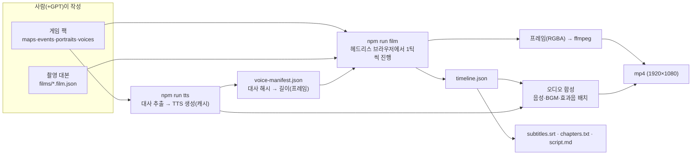

# 영상 제작 파이프라인 설계 (초안)

- 작성일: 2026-10-08
- 상태: V1(녹화) 구현 완료(2026-10-08, 엔진 0.4.0). V2 이후는 설계 초안. 실제 구현과 다른 세부(녹화 API 등)는 `docs/decisions.md`의 V1 항목과 `tools/film/README.md`가 기준
- 선행 문서: [02-architecture.md](02-architecture.md) (엔진 명세). 이 문서의 § 번호는 이 문서 기준, 엔진 명세 참조는 "명세 §n"으로 표기

---

## 1. 목표

자작 게임을 **미리 짜 둔 조작대로 자동 플레이**하고, 그 화면과 TTS 음성을 합쳐 **유튜브 영상(30~40분, 1920×1080)** 을 만든다.

참고작: 너진똑 NJT BOOK 「[오만과 편견] 게임으로 만들어봄」「[페스트] 게임판」 — 고전을 쉽게 풀어 비주얼노벨 게임처럼 보여 주는 영상. 참고작이 "애니메이션에 게임 스킨"이라면, 여기서는 **실제로 동작하는 게임을 만들고 그 플레이를 촬영**한다.

| 원칙 | 의미 |
|---|---|
| 게임이 원본이다 | 영상에 나오는 모든 장면은 팩 데이터로 실제 실행된 결과. 편집 툴에서 그림을 덧붙이지 않는다 |
| 다시 찍어도 같다 | 같은 팩·대본·음성 캐시면 프레임 단위로 같은 영상. 대사 하나 고치고 전체를 다시 렌더링해도 나머지는 그대로 |
| 사람 손은 대본과 콘텐츠에만 | 녹화·자막·음성 배치·챕터 표기는 도구가 만든다 |
| 게임 엔진은 영상을 모른다 | 녹화·TTS·합성은 `platform`과 `tools/`에 둔다. `engine/sim`에는 결정론적 데이터(음성 길이 등)만 들어간다 |

## 2. 이미 있는 것과 필요한 것

| 필요 | 현재 상태 |
|---|---|
| 같은 입력 → 같은 결과 | 있음. 명세 P4 결정론, 고정 60Hz 틱 |
| 조작을 파일로 기술 | 있음. 시나리오 단계(press/walk/advanceText/choose/settle, 명세 §12) |
| 사람 없이 끝까지 실행 | 있음. 헤드리스 시나리오 러너 |
| 16:9 화면 | 팩 설정으로 가능(480×270). M8에서 검증 중 |
| 프레임 단위 진행·캡처 → mp4 | **없음** → V1 |
| 촬영용 대본(멈춤, 목적지까지 걷기, 커서 머뭇거림) | **없음** → V1 |
| 대사 타임라인 → 자막·챕터 | **없음** → V1 |
| TTS 음성 생성·대사 길이 동기화·오디오 합성 | **없음** → V2 |
| 스탠딩 일러스트·표정·배경 CG·전환·BGM/효과음 | **없음**(MVP 밖) → V3 |
| 원작 → 장면·대사·팩 데이터 초안 | **없음** → V4 |

## 3. 전체 흐름



## 4. 녹화 모드 (V1)

### 4.1 방식: 실제 브라우저 + 수동 틱 진행

- 플레이어가 보는 것과 **같은 렌더러**로 찍기 위해 헤드리스 Chromium(Playwright)을 쓴다. Node에서 캔버스를 따로 구현하면 폰트 렌더링·이미지 보간이 달라진다.
- 녹화 모드(`?record=<film>`, dev 서버 또는 빌드 산출물)에서는 `requestAnimationFrame` 루프를 끄고, 페이지가 `window.__recorder`를 노출한다.
  - `step(n)`: 시뮬레이션을 n틱 진행(입력은 대본에서 생성한 프레임을 사용)
  - `frame()`: 현재 화면을 그리고 RGBA 픽셀을 반환
  - `events()`: 직전 호출 이후 타임라인 이벤트
- Node 쪽 `tools/film/record.ts`가 `step → frame → ffmpeg stdin` 을 반복한다. 실제 시간과 무관하므로 렌더링이 느려도 결과는 정확히 60fps다.

### 4.2 해상도와 프레임레이트

- 월드(맵·캐릭터)는 논리 해상도 480×270으로 그리고 ffmpeg에서 **최근접 4배**(`scale=1920:1080:flags=neighbor`)로 키운다. 브라우저에서 1080p를 직접 캡처하는 것보다 전송량이 16분의 1이다.
- 출력 프레임레이트는 기본 **30fps**(2틱마다 1프레임). 60fps 옵션 제공. 30분 영상 기준 54,000프레임.
- 고해상도 일러스트가 들어가는 V3 이후의 합성 방식은 §6.1 참고.

### 4.3 촬영 대본 (`packs/<id>/films/<name>.film.json`)

시나리오 단계(명세 §12)의 상위 집합. 테스트용 시나리오와 달리 **보기 좋게 플레이하는 것**이 목적이다.

```json
{
  "name": "1화 — 저택에 도착하다",
  "start": { "map": "hall", "x": 7, "y": 12, "dir": "up" },
  "fps": 30,
  "steps": [
    { "chapter": "도착" },
    { "pause": 1.5 },
    { "walkTo": { "event": "butler" } },
    { "press": "ok" },
    { "advanceText": "voice" },
    { "choose": 1, "dwell": 0.6 },
    { "advanceText": "voice" },
    { "chapter": "첫 번째 단서" },
    { "walkTo": { "x": 3, "y": 4 }, "speed": "normal" },
    { "expect": { "flag": "found_letter", "is": true } }
  ]
}
```

| 추가 단계 | 동작 |
|---|---|
| `pause: 초` | 입력 없이 진행 |
| `walkTo: {event}` 또는 `{x,y}` | 충돌 격자에서 최단 경로(BFS)를 구해 방향 입력으로 풀어 냄. 이벤트 대상이면 그 앞 칸까지 가서 바라봄. 경로가 없으면 대본 오류 |
| `advanceText: "voice"` | 음성이 끝날 때까지 기다린 뒤 다음 대사(§5.3). `"press"`면 기존처럼 ok 연타 |
| `choose: n, dwell: 초` | 커서를 한 칸씩 옮길 때마다 dwell만큼 머뭇거려 "사람이 고르는" 느낌 |
| `chapter: 제목` | 타임라인에 챕터 표시 → 유튜브 챕터·부분 렌더링 단위 |
| `expect` | 그대로 사용. 대본이 의도와 다르게 흘러가면 렌더링 전에 실패 |

대본은 먼저 **헤드리스 리허설**(시나리오 러너와 같은 경로)로 끝까지 검증한 뒤에 녹화한다. 30분 녹화가 25분째에서 실패하는 일을 막는다.

### 4.4 타임라인과 부산물

`out/<pack>/<film>/` (gitignore)

| 파일 | 내용 |
|---|---|
| `video.mp4` | 최종 영상(V2부터 음성 포함) |
| `timeline.json` | `{frame, type, ...}` 목록. type: `text-start`/`text-end`(speaker, text, voiceKey), `choice`(labels, chosen), `map`, `chapter`, `bgm`, `sfx` |
| `subtitles.srt` | text-start~text-end 구간 자막. 유튜브에 별도 업로드(번인하지 않음) |
| `chapters.txt` | `00:00 도착` 형식. 설명란에 그대로 붙여넣기 |
| `script.md` | 화자·대사·선택지를 시간순으로 정리한 대본. 검수용 |

부분 렌더링: `--chapter <제목>`이면 그 챕터 직전까지는 캡처 없이 시뮬레이션만 빨리 진행하고 해당 구간만 찍는다. 결정론 덕분에 전체 렌더링과 같은 프레임이 나온다.

## 5. TTS (V2)

> V2에는 나레이션 단계(`narrate`, `waitNarration`, `music`)도 함께 들어간다. 나레이션은 게임 대화창이 아니라 촬영 대본 층이며, 형식과 작법은 [07-narration-style.md](07-narration-style.md) §7을 따른다. 결정적 대사는 인물별 목소리로 읽게 할 수 있다(07 §8 기법 21).

### 5.1 화자와 목소리

- `packs/<id>/voices.json`: 화자 표시 이름 → 목소리 설정. `text.speaker`가 없으면 `narrator`.

```json
{
  "narrator": { "provider": "<제공자>", "voice": "<목소리 ID>", "speed": 1.0 },
  "집사": { "provider": "<제공자>", "voice": "<목소리 ID>", "speed": 0.95 }
}
```

- 기존 `text` 커맨드 형식은 바꾸지 않는다(formatVersion 유지). 대사와 목소리는 **(목소리 설정 + 대사 문자열)의 해시**로 연결한다. 대사를 고치면 해시가 바뀌어 그 줄만 다시 생성된다.

### 5.2 생성 도구

- `npm run tts -- <pack>`: 모든 `text`(공통 이벤트·플러그인 커맨드가 보여 주는 대사는 §9 참고)를 추출해 캐시에 없는 것만 생성한다.
- 제공자는 `tools/tts/` 아래 `TtsProvider { synthesize(text, voice): Promise<{ wav: Buffer }> }` 인터페이스로 분리한다. 첫 구현은 하나만 만들고 교체 가능하게 둔다.
- 캐시: `.cache/voice/<pack>/<hash>.wav` (gitignore). 매니페스트 `packs/<id>/voice-manifest.json`(커밋)에 `hash → { frames, provider, voice, generatedAt }` 기록.
- TTS 결과는 같은 입력이어도 매번 조금씩 다를 수 있다. 그래서 **길이는 매니페스트 값을 기준**으로 삼고, 캐시 파일을 잃어 다시 생성하면 길이 차이를 경고한다.
- 대사 앞뒤 기호(…, ―, 괄호 지문)를 TTS에 그대로 넘길지 정리할지 규칙을 둔다(§9).

### 5.3 음성 길이 동기화 (sim에 들어가는 유일한 영상 관련 기능)

- `Game` 옵션으로 **읽기 전용 음성 길이표**(`hash → frames`)를 받는다. 순수 데이터라 결정론과 헤드리스 원칙(명세 P3·P4)을 해치지 않는다.
- 녹화 모드의 메시지 창은 `max(글자 표시 완료, 음성 길이) + 여백(기본 0.4초)`이 지나면 스스로 닫힌다. 일반 플레이에서는 기존처럼 ok로 넘긴다(음성 재생은 선택 기능).
- 타임라인 `text-start`에 `voiceKey`가 남으므로 오디오 합성 단계에서 정확한 프레임에 음성을 놓을 수 있다.

### 5.4 오디오 합성

- `timeline.json`을 읽어 ffmpeg 필터(`adelay` + `amix`)로 음성·BGM·효과음을 한 트랙으로 만든다. BGM은 대사 구간에서 자동으로 볼륨을 낮춘다(덕킹).
- 영상과 오디오를 합쳐 `video.mp4`를 만든다. 음량은 유튜브 기준(약 -14 LUFS)으로 정규화한다.

## 6. 비주얼노벨 표현 (V3)

엔진 명세에서 "MVP 밖"이었던 기능 중 영상에 필요한 것만 추가한다. 커맨드·선택 필드 추가는 명세 §13.2에 따라 **formatVersion을 올리지 않는다**(엔진 minor).

| 커맨드 / 데이터 | 내용 |
|---|---|
| `portraits.json` | 캐릭터 → 표정 → 이미지 경로 |
| `show_portrait` | `character`, `expression`, `slot`(left/center/right), `enter`(fade/slide/none) |
| `hide_portrait` | `slot` 또는 `character`, `exit` |
| `text` 선택 필드 | `expression`(화자 스탠딩 표정 변경), `speed`(글자 속도 배율) |
| `background` | 배경 CG 표시/해제, `transition`(fade/cut). 표시 중에는 맵 대신 CG |
| `bgm` / `sfx` | `audio.json`의 ID로 재생·정지·페이드. 녹화 모드에서는 타임라인에 기록 |
| `wait` | 기존 그대로(연출 간격) |

### 6.1 고해상도 레이어

스탠딩 일러스트와 배경 CG는 1920×1080 해상도로 그려진 그림이다. 이걸 480×270에 그렸다가 4배로 키우면 뭉개진다. 그래서 화면을 두 겹으로 그린다.

| 레이어 | 해상도 | 내용 |
|---|---|---|
| 픽셀 레이어 | 480×270 → 최근접 ×4 | 맵, 캐릭터, 화면 효과 |
| HD 레이어 | 1920×1080 | 배경 CG, 스탠딩, 메시지 창·선택지·글자 |

녹화는 두 레이어를 브라우저에서 합성한 1080p 프레임을 캡처한다(§4.2의 4배 축소 전송 이점은 V3부터 사라지므로, 30fps 기본값이 더 중요해진다). 글자를 HD 레이어로 옮기면 유튜브 화질에서 가독성이 좋아진다. 픽셀 폰트 느낌을 유지할지는 §9에서 정한다.

### 6.2 아트 방향: 기본 마스코트 + 원작 의상

모든 작품의 등장인물을 **하나의 데포르메 기본 캐릭터(마스코트)** 로 그리고, 원작 인물의 의상·소품·머리 모양·색을 입혀 구분한다. 한 캐릭터가 여러 작품에 콜라보·패러디로 등장하는 방식이다.

이 방향이 파이프라인에 주는 이점

| 이점 | 이유 |
|---|---|
| 이미지 생성의 일관성 | 매번 같은 기본형(비율·실루엣·얼굴)을 참조 이미지로 주므로 작품·인물이 바뀌어도 그림체가 흔들리지 않는다 |
| 표정 재사용 | 얼굴이 단순하고 모든 인물이 같은 얼굴 구조라 **표정 세트를 한 번 정해 모든 의상에 공유**할 수 있다 |
| 도트 스프라이트 생성 | 맵용 작은 캐릭터도 기본 몸체가 같으므로 기본 시트 하나에 **색 바꾸기 + 소품 덧그리기**로 인물별 시트를 스크립트로 만들 수 있다 |
| 채널 정체성 | 같은 마스코트가 영상마다 다른 의상으로 나온다. 마스코트를 진행자(내레이터)로 고정해도 된다 |

**캐릭터 바이블** (`packs/_shared/mascot/`, 이미지 생성과 에셋 제작의 기준)
- 기본형 시트: 정면·3/4 측면, 머리·몸 비율, 선 굵기, 기본 색, 금지 사항(입체 음영 금지 등)
- 표정 세트(공통 이름): `neutral` `smile` `laugh` `surprised` `sad` `angry` `flustered` `thinking` — 모든 의상이 같은 이름을 쓴다. V4의 대사 생성도 이 이름만 쓴다
- 고정 캔버스 규격: 스탠딩 이미지 크기, 발밑 기준선, 얼굴 위치. 의상이 달라도 같은 자리에 서도록
- 이미지 생성 프롬프트 템플릿과 참조 이미지. 생성한 이미지마다 사용한 프롬프트를 함께 저장해 다시 만들 수 있게 한다

**스탠딩 데이터 형식** — 두 가지를 모두 받을 수 있게 정의하고, 아트 시험(§9)으로 어느 쪽을 주로 쓸지 정한다.

```json
{
  "elizabeth": {
    "costume": "assets/portraits/elizabeth.png",
    "face": { "x": 412, "y": 300 },
    "expressions": "mascot"
  },
  "darcy": {
    "images": { "neutral": "assets/portraits/darcy_neutral.png", "angry": "assets/portraits/darcy_angry.png" }
  }
}
```

| 방식 | 장점 | 단점 |
|---|---|---|
| 겹치기(`costume` + 공통 `face` 세트) | 이미지 수가 의상 수만큼만 필요. 표정이 모든 인물에서 완전히 같다 | 생성한 의상 이미지의 얼굴 자리가 정확히 비어 있거나 덮을 수 있어야 함 |
| 통짜(`images`) | 생성 결과를 그대로 씀. 인물별 특수 표정 가능 | 인물 × 표정만큼 생성해야 하고 표정 일관성이 흔들릴 수 있음 |

**공유 라이브러리**: 마스코트 표정 세트, UI 스킨, 폰트, 효과음, 내레이터 목소리는 모든 작품이 함께 쓴다. 엔진 명세 §14에서 "MVP는 복사"로 미뤘던 **공유 라이브러리 팩(`packs/_shared/<lib>`, `game.json.include`)을 V3에서 구현**한다. 작품이 늘수록 복사본을 고치는 비용이 커지기 때문이다.

**주의**: 치이카와는 "한 캐릭터를 여러 작품에 입히는" 방식의 참고일 뿐이다. 마스코트의 외형은 **독자적으로 디자인**해야 한다. 기존 캐릭터와 닮게 생성하면 저작권·상표 문제가 생기고 수익화에도 걸린다. 생성 프롬프트에 기존 캐릭터 이름을 넣지 않는다.

## 7. 콘텐츠 파이프라인 (V4)

원작을 영상용 게임으로 옮기는 작업. 분량이 크고 자동 검증이 받쳐 주므로 GPT를 쓰기 좋다.

1. **장면 분할**: 원작 요약 → 챕터·장면 목록(인물, 장소, 핵심 사건, 해설 포인트)
2. **대사 작성**: 장면별 대사·내레이션·선택지(선택지는 "해석의 갈림길"을 보여 주는 연출용)
3. **팩 데이터 생성**: 맵 배치, 이벤트, 플래그 → `npm run validate`로 검사
4. **촬영 대본 생성**: 장면 순서대로 film 단계 → 헤드리스 리허설
5. **검수**: `script.md`로 사람이 읽고 수정 → 2로 돌아감

저작권 주의: 원작의 저작권이 끝났어도 **한국어 번역본은 번역자에게 별도 저작권**이 있다. 번역문을 옮기지 않고 요약·재서술한다. 참고 문헌은 설명란에 출처로 남긴다(참고작도 논문 목록을 붙였다).

## 8. 단계별 구현 계획

| 단계 | 범위 | 완료 기준 |
|---|---|---|
| V1 녹화 **(완료)** | 녹화 모드(§4.1), film 형식과 리허설(§4.3), walkTo 경로 탐색, 타임라인·SRT·챕터(§4.4), 부분 렌더링 | `manor`의 결말 하나를 무음 mp4로 렌더링. 두 번 렌더링한 영상의 프레임 해시가 같음 |
| V2 TTS | voices.json, tts 도구와 제공자 1개, 매니페스트, 음성 길이 동기화(§5.3), 오디오 합성, 나레이션 단계(07 §7) | 나레이션과 대사 음성이 들어간 mp4. 대사 하나를 고치면 그 줄만 다시 생성 |
| V3 VN 표현 | 고해상도 레이어, 스탠딩·표정·배경 CG·전환, BGM·효과음, 공유 라이브러리 팩(§6.2), 마스코트 기반 도트 스프라이트 생성 스크립트 | 의상이 다른 마스코트 2명이 공통 표정으로 대화하고 배경 CG가 바뀌는 장면이 든 영상 |
| V4 콘텐츠 | 원작 → 팩·대본 생성 흐름, 검수 문서 | 고전 한 편의 1화 분량(10분 안팎) 완성 |

V1을 가장 먼저 하는 이유는 **끝에서 끝까지 영상이 나오는 경로를 가장 빨리 확인**하기 위해서다. TTS를 V3보다 앞에 두는 이유는 음성 길이가 모든 장면의 타이밍을 결정하기 때문이다.

## 9. 결정 필요

| 항목 | 선택지 | 권장 |
|---|---|---|
| TTS 제공자 | OpenAI TTS, ElevenLabs, 한국어 특화 서비스(Typecast, CLOVA Voice 등) | 한국어 품질은 직접 들어 봐야 판단 가능. **같은 대사 10줄로 2~3곳을 비교**한 뒤 결정. 인터페이스로 분리해 두므로 나중에 바꿀 수 있음 |
| TTS 비용·약관 | — | ChatGPT·Codex 구독과 API 사용료는 별도 과금일 수 있으니 확인. 유튜브 수익화 시 음성의 상업적 이용 조건과 유튜브의 합성 콘텐츠 표시 정책도 확인 |
| 글자 렌더링 | 픽셀 폰트(Galmuri) 유지 / HD 폰트(가독성) | V1·V2는 픽셀 폰트, V3에서 HD 레이어로 옮길 때 비교 |
| 프레임레이트 | 30 / 60 | 30(렌더 시간 절반, 정적 장면이 많은 장르) |
| 음성 캐시 보관 | 커밋 / 캐시만(gitignore) + 별도 백업 | 캐시만. 용량이 크고 매니페스트로 길이는 보존됨 |
| 플러그인이 띄우는 대사 | tts 추출 대상에 포함 / 제외 | 대사는 `text` 커맨드로만 쓰는 규칙을 두고, 플러그인은 `ctx.showText`에 넘긴 문자열을 녹화 중 타임라인에서 경고 |
| 메시지 자동 진행 여백 | 0.3~0.8초 | 0.4초 기본, 팩·대사별 덮어쓰기 |
| 마스코트 디자인 | — | V3 전에 확정. 기본형 시트와 표정 8종을 먼저 만들고, 그걸 참조로 의상 2~3벌을 생성해 일관성 확인 |
| 스탠딩 방식(§6.2) | 겹치기 / 통짜 | 위 아트 시험 결과로 결정. 생성 이미지의 얼굴 자리가 안정적이면 겹치기 |

## 10. 엔진 명세와의 관계

- 엔진 명세의 원칙(P1~P6)은 그대로 유지한다. 녹화 모드는 `platform`, 대본 해석·TTS·합성은 `tools/`에 둔다.
- `engine/sim`에 들어가는 변경은 두 가지뿐이다. 음성 길이표를 받는 옵션과 메시지 자동 진행(§5.3), 그리고 V3의 비주얼노벨 커맨드다.
- V3 커맨드와 데이터 파일은 확정되면 엔진 명세(02)에 정식 섹션으로 옮긴다. 이 문서는 파이프라인 설계로 남긴다.
