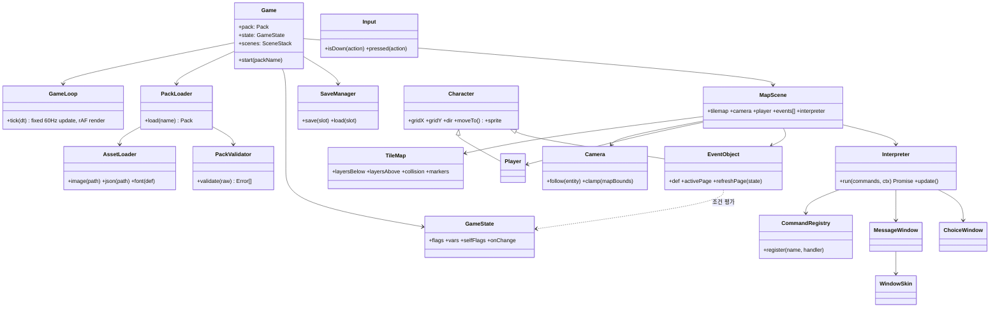

# 데이터 구동형 2D RPG 엔진 설계

- 작성일: 2026-10-02
- 상태: 초안. 구현 전에 확정할 것은 마지막의 "결정 필요" 항목을 참고
- 선행 문서: [01-source-verification.md](01-source-verification.md)

## 1. 목표와 원칙

**목표**: 엔진 코드는 한 번 만들고 고정한다. 맵·대사·스토리·캐릭터·UI 스킨은 **게임 팩(pack)** 이라는 데이터 폴더로 분리한다. 팩만 바꿔 끼우면 다른 게임이 된다.

| 원칙 | 의미 |
|---|---|
| 엔진은 팩을 모른다 | 엔진 코드 안에 특정 게임의 맵 ID, 대사, 이미지 경로가 하나도 없어야 함 |
| 로직도 데이터다 | "말 걸면 플래그 세우고 문 열기" 같은 흐름은 JSON 이벤트 커맨드로 표현 |
| 편집기는 만들지 않는다 | 맵은 Tiled, 나머지는 JSON 직접 편집(또는 Claude가 생성) |
| 빌드 없이 돌아간다 | Vanilla JS + ES Modules. 정적 서버 하나면 실행 |
| 잘못된 팩은 로드 시점에 거부 | 실행 중에 죽지 않고, 시작할 때 어느 파일 몇 번째 항목이 틀렸는지 알려줌 |

**범위 밖 (MVP 제외)**: 전투, 인벤토리 UI, 다국어, 사운드 믹싱, 모바일 터치 컨트롤, 멀티플레이. 엔진 구조는 이후에 추가할 수 있게 열어 두되, 지금 만들지는 않는다.

## 2. 디렉터리 구조

```
rpg-engine/
├── index.html                # 진입점. ?pack=<이름> 으로 팩 선택
├── engine/                   # ── 고정 영역. 팩 작업 중에는 수정하지 않음 ──
│   ├── core/                 # Game, GameLoop, Input, AssetLoader
│   ├── data/                 # PackLoader, PackValidator
│   ├── world/                # MapScene, TileMap, Camera, CollisionGrid
│   ├── entity/               # Character, Player, EventObject, Sprite
│   ├── event/                # Interpreter, commands/*, conditions
│   ├── ui/                   # MessageWindow, ChoiceWindow, WindowSkin
│   ├── state/                # GameState(플래그·변수), SaveManager
│   └── main.js
├── schemas/                  # 팩 JSON Schema (draft 2020-12)
├── packs/
│   └── demo/                 # ── 교체 영역. 게임 하나 = 폴더 하나 ──
│       ├── game.json
│       ├── characters.json
│       ├── skin.json
│       ├── maps/
│       │   ├── village.tmj       # Tiled 맵 (JSON 내보내기)
│       │   └── village.events.json
│       ├── common-events.json
│       └── assets/{tilesets,characters,ui,faces}/
├── tools/
│   ├── validate-pack.mjs     # node tools/validate-pack.mjs demo
│   └── build.mjs             # node tools/build.mjs demo → dist/demo/
└── docs/
```

`tools/`만 Node를 쓴다. 의존성은 JSON Schema 검증용 `ajv` 하나다. 브라우저 런타임에는 외부 의존성이 없다.

## 3. 게임 팩 데이터 명세

모든 경로는 **팩 루트 기준 상대경로**다. ID는 `^[a-z][a-z0-9_]*$` 형식이다.

### 3.1 `game.json` — 팩 매니페스트

```json
{
  "$schema": "../../schemas/game.schema.json",
  "formatVersion": 1,
  "title": "작은 마을의 비밀",
  "screen": { "width": 320, "height": 240, "scale": 3 },
  "tileSize": 16,
  "start": { "map": "village", "x": 10, "y": 8, "dir": "down" },
  "player": "hero",
  "initialState": {
    "flags": { "met_elder": false },
    "vars":  { "gold": 0 }
  }
}
```

- `formatVersion`: 엔진이 지원하는 팩 포맷 버전. 맞지 않으면 로드를 거부한다. 엔진이 바뀌어도 오래된 팩이 조용히 깨지는 일을 막는다.
- `initialState`에 플래그와 변수를 **미리 선언**한다. 이벤트에서 선언하지 않은 플래그를 참조하면 검증 단계에서 오류로 잡는다. 오타 방지 목적이다.

### 3.2 `characters.json` — 캐릭터 스킨

```json
{
  "hero": {
    "sheet": "assets/characters/hero.png",
    "frameWidth": 16, "frameHeight": 24,
    "directions": { "down": 0, "left": 1, "right": 2, "up": 3 },
    "walkFrames": [0, 1, 0, 2],
    "frameDuration": 8,
    "anchor": { "x": 8, "y": 22 }
  },
  "elder": { "sheet": "assets/characters/elder.png", "frameWidth": 16, "frameHeight": 24, "...": "..." }
}
```

시트 한 장에 행은 방향, 열은 걷기 프레임으로 둔다. RPG Maker 시트의 행 순서(하·좌·우·상)를 기본값으로 따른다.

### 3.3 맵 — Tiled `.tmj` + 이벤트 JSON 분리

**Tiled 파일이 맡는 것** (Tiled 1.10+ JSON 내보내기, 정사각 타일, `orientation: orthogonal`)

| 레이어 이름 규칙 | 종류 | 용도 |
|---|---|---|
| `ground`, `deco` … | tilelayer | 캐릭터 **아래**에 그림 (순서대로) |
| `over_*` | tilelayer | 캐릭터 **위**에 그림 (지붕, 나무 윗부분) |
| `collision` | tilelayer | 0이 아닌 칸은 통행 불가. 렌더링하지 않음 |
| `markers` | objectgroup | 이름 붙인 좌표. 맵 이동 도착점 등 |

타일셋은 외부 `.tsj`나 임베드 모두 허용한다. 이미지 경로는 Tiled 기준 상대경로를 그대로 해석한다.

**`<맵ID>.events.json`이 맡는 것**: 이 맵의 NPC, 상자, 문, 트리거. 이벤트 위치도 여기에 둔다. 위치를 Tiled 쪽에 두면 한 이벤트의 정의가 두 파일로 갈라져 동기화가 어려워지기 때문이다.

```json
{
  "map": "village.tmj",
  "bgm": null,
  "events": [
    {
      "id": "elder",
      "x": 12, "y": 6,
      "pages": [
        {
          "when": { "flag": "met_elder", "is": false },
          "character": "elder", "dir": "down",
          "trigger": "action",
          "commands": [
            { "cmd": "face_player" },
            { "cmd": "text", "speaker": "촌장", "face": "elder", "text": "처음 보는 얼굴이군." },
            { "cmd": "choice", "options": [
                { "label": "여행자입니다", "commands": [
                    { "cmd": "text", "speaker": "촌장", "text": "북쪽 동굴은 조심하게." }
                ]},
                { "label": "…", "commands": [] }
            ]},
            { "cmd": "set_flag", "flag": "met_elder", "value": true }
          ]
        },
        {
          "character": "elder", "dir": "down",
          "trigger": "action",
          "commands": [
            { "cmd": "text", "speaker": "촌장", "text": "또 왔나." }
          ]
        }
      ]
    },
    {
      "id": "to_house",
      "x": 5, "y": 3,
      "pages": [{
        "trigger": "touch", "through": true,
        "commands": [ { "cmd": "transfer", "map": "house", "marker": "door_in", "dir": "up", "fade": true } ]
      }]
    }
  ]
}
```

### 3.4 이벤트 페이지 규칙

RPG Maker의 "이벤트 페이지" 모델을 따른다. 이미 검증된 모델이고, 쯔꾸르 사용자에게도 익숙하다.

- 한 이벤트는 여러 페이지를 가진다. **조건(`when`)을 만족하는 페이지 중 가장 마지막 페이지**가 활성이 된다. 조건이 없는 페이지는 항상 만족한다.
- 활성 페이지는 플래그나 변수가 바뀔 때마다 다시 계산한다. 그래서 대사가 바뀌거나 NPC가 사라지는 동작을 커맨드 없이 데이터만으로 표현할 수 있다.
- 활성 페이지가 없으면 그 이벤트는 보이지도 않고 충돌하지도 않는다.

| `trigger` | 발동 시점 |
|---|---|
| `action` | 플레이어가 마주 보고 확인 키 |
| `touch` | 플레이어가 그 칸에 들어감 (`through: true`로 밟을 수 있게) |
| `auto` | 페이지가 활성화되면 즉시 1회 실행. 플레이어 조작 차단 (컷신용) |
| `parallel` | 활성인 동안 매 반복 실행. 조작을 막지 않음 (MVP에서는 1개 맵당 제한 없음, 커맨드는 `wait` 중심) |

`auto` 이벤트는 실행 끝에 조건을 바꾸지 않으면 무한 반복된다. RPG Maker의 고질적인 함정이다. 검증기가 **"auto 페이지의 commands에 자기 조건을 바꾸는 set_flag/set_var가 없으면 경고"** 를 띄운다.

### 3.5 조건식 (`when`, `if`)

```json
{ "flag": "met_elder", "is": true }
{ "var": "gold", "op": ">=", "value": 10 }
{ "all": [ <조건>, <조건> ] }
{ "any": [ <조건>, <조건> ] }
{ "not": <조건> }
```

`op`: `==`, `!=`, `>`, `>=`, `<`, `<=`. 문자열 수식(`"gold >= 10"`)은 쓰지 않는다. 파서가 필요 없고, 스키마로 검증할 수 있으며, `eval`을 쓸 위험도 없다.

### 3.6 이벤트 커맨드 (MVP 16종)

RPG Maker MV는 `{code: 101, indent: 0, parameters: [...]}` 처럼 숫자 코드와 indent로 블록을 표현한다. 여기서는 **이름 있는 커맨드와 중첩 배열**을 쓴다. 사람이 읽고 Claude가 생성하기에 이쪽이 훨씬 오류가 적다.

| 분류 | `cmd` | 주요 필드 | 대기 |
|---|---|---|---|
| 대화 | `text` | `text`, `speaker?`, `face?` | 닫힐 때까지 |
| | `choice` | `options[{label, commands, when?}]`, `cancel?` | 선택까지 |
| 흐름 | `if` | `cond`, `then[]`, `else?[]` | – |
| | `call` | `common` (common-events.json의 ID) | 끝날 때까지 |
| | `wait` | `frames` | O |
| | `stop` | – (현재 이벤트 중단) | – |
| 상태 | `set_flag` | `flag`, `value` | – |
| | `set_var` | `var`, `op`(`set/add/sub`), `value` | – |
| 이동 | `transfer` | `map`, `marker` 또는 `x,y`, `dir?`, `fade?` | 완료까지 |
| | `move` | `target`(`player`/이벤트ID), `route["up","up","left",…]`, `wait?` | 선택 |
| | `face` | `target`, `dir` | – |
| | `face_player` | – | – |
| 연출 | `fade` | `to`(`black`/`clear`), `frames` | O |
| | `shake` | `power`, `frames` | 선택 |
| | `show_character` | `target`, `visible` | – |
| 조작 | `lock_player` | `value` | – |

`move.route`는 `"up"`, `"down"`, `"left"`, `"right"`, `"wait:N"`, `"face:dir"` 같은 문자열 토큰 배열이다.

커맨드를 추가할 때는 `engine/event/commands/` 에 파일 하나를 넣고, 스키마의 `oneOf`에 항목 하나를 추가하면 된다. 인터프리터 코어는 건드리지 않는다.

### 3.7 `common-events.json`

여러 맵에서 공유하는 커맨드 묶음이다. `{ "<id>": { "commands": [...] } }` 형태로 두고 `call`로 호출한다.

### 3.8 `skin.json` — UI 스킨

```json
{
  "font": { "family": "Galmuri11", "src": "assets/ui/Galmuri11.woff2", "size": 12, "lineHeight": 16 },
  "window": { "image": "assets/ui/window.png", "slice": 8, "padding": 8, "opacity": 0.92 },
  "colors": { "text": "#ffffff", "speaker": "#ffd866", "choiceCursor": "#ffffff" },
  "message": { "rows": 3, "position": "bottom", "charsPerFrame": 1 }
}
```

창 테두리는 9-slice 이미지로 그린다. 폰트는 팩에 포함된 웹폰트를 `FontFace`로 로드한다. 픽셀 게임에서는 Galmuri 같은 OFL 비트맵 한글 폰트를 권한다.

## 4. 엔진 구조

### 4.1 모듈 관계



### 4.2 핵심 동작

**게임 루프**: 업데이트는 고정 60Hz(누적 시간 방식)로, 렌더는 `requestAnimationFrame`으로 돌린다. 모니터 주사율이 달라도 이동 속도와 `wait` 프레임 수가 일정하게 유지된다.

**그리드 이동**: 캐릭터는 타일 단위로 움직이고, 칸과 칸 사이는 픽셀 보간한다. 이동을 시작할 때 목표 칸을 **예약**해서 두 캐릭터가 같은 칸으로 동시에 들어가는 것을 막는다. 통행 판정 순서는 맵 경계 → `collision` 레이어 → 다른 캐릭터(`through` 제외)다.

**인터프리터**: 커맨드 핸들러는 `async (args, ctx) => void` 형태다.
- 대기가 필요한 커맨드는 Promise를 반환한다. `text`는 창이 닫힐 때 resolve되고, `wait`는 `ctx.frames(n)`(루프가 n번 업데이트된 뒤 resolve)를 쓴다.
- 중첩 블록(`if`, `choice.commands`)은 인터프리터가 하위 배열을 재귀 실행한다.
- 동시에 도는 인터프리터는 1개의 **메인**(action/touch/auto, 동시에 하나만)과 이벤트별 **parallel**들이다. 메인이 실행 중이면 플레이어 입력과 다른 action/touch 발동을 막는다.
- `transfer`로 맵이 바뀌면 이전 맵의 parallel 인터프리터는 모두 취소한다. 취소는 `AbortSignal`로 전달한다.

**페이지 재계산**: `GameState.onChange`가 발생하면 현재 맵의 모든 `EventObject.refreshPage()`를 다음 업데이트 시작 시점에 한 번만 실행한다. 한 프레임 안의 여러 변경은 합쳐서 처리한다.

**렌더 순서**: below 레이어 → 캐릭터(y좌표 순 정렬) → `over_*` 레이어 → 화면 효과(fade/shake) → UI 창. 캔버스는 논리 해상도(320×240)로 그린 뒤 CSS로 정수배 확대하고, `image-rendering: pixelated`를 적용한다.

**세이브**: `localStorage`에 `{ packId, formatVersion, map, x, y, dir, flags, vars, selfFlags, savedAt }`를 저장한다. 키에 packId를 넣어 팩끼리 세이브가 섞이지 않게 한다. MVP는 슬롯 1개다.

### 4.3 팩 로딩과 검증

1. `?pack=demo` → `packs/demo/game.json`을 읽고 `formatVersion`을 확인한다.
2. `characters.json`, `skin.json`, `common-events.json`, 그리고 `start.map`의 `.events.json`과 `.tmj`를 읽는다. 다른 맵은 `transfer` 시점에 지연 로드하고 캐시한다.
3. **런타임 검증**(가벼움): 필수 필드, 참조 무결성(캐릭터 ID, 맵 파일, marker, 공통 이벤트 ID, 플래그/변수 선언)을 확인한다. 실패하면 캔버스 대신 오류 목록을 화면에 표시한다.
4. **오프라인 검증**(`tools/validate-pack.mjs`): JSON Schema로 전체 팩을 검사하고, 3단계의 참조 검사와 auto 이벤트 무한루프 경고까지 실행한다. 팩을 만든 뒤 항상 돌린다.

참조 검사 로직은 `engine/data/PackValidator.js` 한 곳에 두고, 브라우저와 Node 도구가 함께 import한다.

## 5. 새 게임을 찍어내는 흐름

1. `packs/demo`를 복사해 `packs/<새이름>`을 만든다.
2. Tiled로 맵을 그리고 `.tmj`로 내보낸다.
3. `game.json`, `characters.json`, `*.events.json`을 작성한다. Claude에게 시킬 때는 `schemas/`와 이 문서를 컨텍스트로 준다.
4. `node tools/validate-pack.mjs <새이름>`을 실행한다.
5. `index.html?pack=<새이름>`으로 플레이 테스트한다.
6. `node tools/build.mjs <새이름>`을 실행하면 `dist/<새이름>/`에 엔진과 해당 팩만 담긴 정적 사이트가 만들어진다. itch.io나 GitHub Pages에 그대로 올리면 된다.

## 6. 구현 순서

| 단계 | 내용 | 완료 기준 |
|---|---|---|
| M1 | 루프, 입력, AssetLoader, Tiled 맵 렌더, 카메라 | demo 맵이 화면에 그려지고 화살표로 카메라가 움직임 |
| M2 | Character, 그리드 이동, 충돌, 걷기 애니메이션 | 플레이어가 벽을 통과하지 못하고 걸어 다님 |
| M3 | EventObject, 페이지 조건, Interpreter, text/choice/set_flag/if | 촌장과 대화하면 두 번째 대사가 바뀜 |
| M4 | transfer, fade, move, auto/parallel, common events | 집 안 출입, 입장 컷신 1개 |
| M5 | 스키마, validate-pack, 런타임 오류 화면, 세이브, build | 일부러 깨뜨린 팩이 명확한 오류로 거부됨 |
| M6 | **두 번째 팩**을 엔진 수정 없이 제작 | 설계 목표 검증. 엔진 수정이 필요했다면 그 지점이 설계 결함 |

M6이 이 프로젝트의 진짜 테스트다. 두 번째 팩을 만들면서 엔진을 고쳐야 했던 지점을 기록하고 데이터 쪽으로 옮긴다.

테스트는 순수 로직(조건 평가, 페이지 선택, 인터프리터 흐름, 충돌, 검증기)만 Node 내장 `node:test`로 단위 테스트한다. 렌더링은 데모 팩을 직접 플레이해서 확인한다.

## 7. 결정 필요

| 항목 | 권장안 | 대안 |
|---|---|---|
| 언어 | Vanilla JS + JSDoc 타입 주석 (빌드 없음) | TypeScript + Vite. 타입 안전성은 높지만 빌드 단계가 생김 |
| 타일 크기 / 해상도 | 16px, 320×240 ×3 | 32px, 640×480 (RPG Maker MV 계열 에셋을 쓸 경우) |
| 데모 팩 에셋 | CC0 무료 에셋 (예: Kenney의 탑다운 타일셋) | 직접 제작, 또는 임시 단색 도형 |
| 맵 에디터 | Tiled (무료, 설치 필요) | 엔진 자체 포맷 + 손으로 작성한 JSON (작은 맵만 가능) |

에셋은 라이선스를 반드시 팩 폴더의 `CREDITS.md`에 남긴다. RPG Maker 기본 에셋(RTP)은 RPG Maker 엔진 밖에서 쓰는 것이 라이선스상 허용되지 않으므로 쓰지 않는다.
